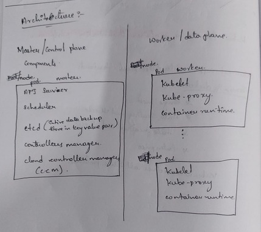

# Architecture

By default, Kubernetes runs as a **cluster**. Below is its architecture:

### Components

- **API Server**: The front-end for the Kubernetes control plane. It exposes the Kubernetes API and validates requests.  
- **etcd**: Key-value store for all cluster data. Stores configuration, state, and metadata.  
- **Controller Manager**: Runs controllers that regulate the cluster (e.g., node controller, replication controller). Ensures desired state matches actual state.  
- **Scheduler**: Assigns pods to nodes based on resource availability, policies, and constraints.  
- **CCM (Cloud Controller Manager)**: Handles interactions with the cloud. It separates cloud-specific logic from the core Kubernetes components.  