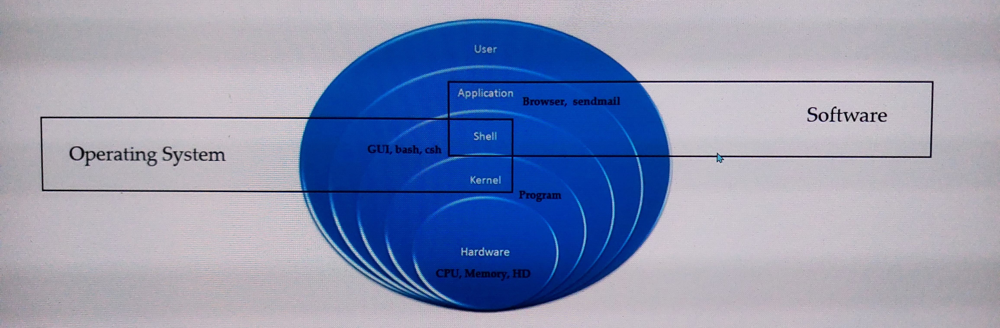

# System Design

## what is linux kernal ? 
Interface between hardware and software.

## system understanding

=======
# System Design

## what is linux kernal ? 
Interface between hardware and software.

## system understanding

