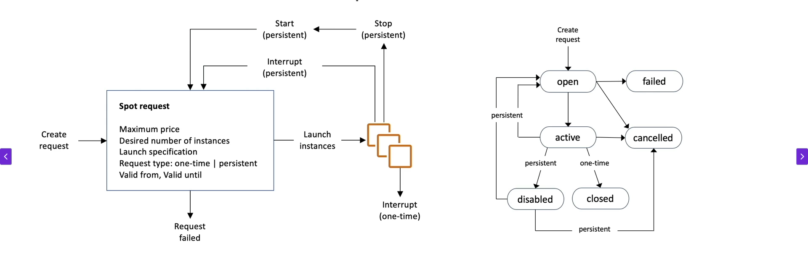

# EC2 Instance Purchasing Options
+ On-Demand Instance - short Workload, predictable pricing, pay by second.
+ Reserved (1 & 3 years)
  + Reserved Instance - Long workloads
  + Convertible Reserved Instances - long workloads with flexible instances
+ Savings Plans (1 & 3 years) - commitment to an amount of usage, long workload
+ Spot Instances - short workloads, cheap, can lose instance (less reliable)
+ Dedicated Hosts - book an entire physical server, control instance placement
+ Dedicated Instances - no other customers will share your hardware
+ Capacity Reservations - reserve capacity in a specific AZ for any duration

## EC2 on Demand

+ Pay for what you use:
  + Linux or windows - billings per second, after the first minute
  + All other operating systems - billing per hour
+ Has the highest cost but no upfront payment
+ No long-term commitment

## EC2 Reserved Instances
+ Up to 72% dicount compared to on-demand
+ reserve a specific instance attributes (Instance Type, Region, Tenancy, OS)
+ Reservation Period - 1 Year or 3 years
+ Payment Options - No upfront, Partial Upfront, All upfront
+ Reserved Instance's Scope - Regional or zonal
+ You can buy and sell in the Reserved Instance Marketplace
+ Convertible Reserved Instance
  + Can change the EC2 instance type, instance family, OS, scope and tenancy
  + Up to 66% discount

## EC2 Savings Plans
+ Get a discount based on long-term usage (up to 72% - same as RIs)
+ Commit to a certain type of usage ($10/hour for 1 or 3 years)
+ Usage beyond EC2 savings plans is billed at the on-demand price
+ Locked to a specific instance family & AWS region 
+ Flexible across:
  + Instance Size 
  + Os
  + Tenancy

## EC2 Spot Instances
+ Can get a discount of up to 90% compated to on-demand
+ Instances that you can **lose** at any point of time if your max price is less than the current spot price
  + The hourly spot price varies based on offer and capacity
  + if the current spot price > your max price you can choose to stop or terminate your instance with a 2 min grace period
  + Other strategy : **Spot Block**
    + "block" spot instance during a specified time frame (1 to 6 hours) without interruptions
    + In rare situations, the instance may be reclaimed
+ The most Cost-efficient instance in AWS
+ Useful for workloads that are resilient to failure
  + Batch Jobs
  + Data analysis
  + Image processing
  + Any distributed workloads
  + Workloads with a flexible start and end time
+ Not suitable for critical jobs or database

+ **How To Terminate Spot Instances**:
  + You can only cancel spot instance requests that are open, active, or disable. **Cancelling a spot requests does not terminate instances (you should terminate instance after terminate spot request)**
  + You must first cancel a spot request, and then terminate the associated spot instances.
  + 

+ **Spot Fleets** : 
  + Spot fleets = set of spot instances + (optional) On-Demand Instances
  + The Spot fleet will try to meet the target capacity with price constraints
    + Define possible launch pools: instance type (m5.large), OS, Availability zone
    + can have multiple launch pools, so that the fleet can choose
    + spot fleet stops launching instances when reaching capacity or max cost
  + Strategies to allocate spot instances:
    + **lowestPrice** : from the pool with the lowest price (cost optimization, short workload)
    + **diversified**: distributed across all pools (great for availability, long workloads)
    + **capacityOptimized**: pool with the optimal capacity for the number of instances
    + **priceCapacityOptimized** (recommended) : pool with highest capacity available. then select the pool with the lowest price (best choice for most workloads)
  + Spot Fleets allow us to automatically request spot Instances with the lowest price

## EC2 Dedicated Hosts
+ A physical server with EC2 instance capacity fully dedicated to your use
+ Allows you address compliance requirements and use your existing server-bound software licenses (per-socket, per-core, per-VM software licenses)
+ Purchasing options:
  + on-demand - pay per second for active dedicated host
  + Reserved - 1 or 3 years(No Upfront, Partial Upfront, All Upfront)
  + The most expensive option
  + Useful for software that have complicated licensing model (BYOL - Bring your own License)
  + Or for companies that have strong regulatory or compliance needs
  

## EC2 Dedicated Instances
+ Instances run on hardware thats dedicated to you 
+ May share hardware with other instanses in same account
+ No control over instance placement (can move hardware after stop / start)

## EC2 Capacity Reservations
+ Reserve On-Demand instances capacity in a specific AZ for any furation 
+ You always have access to EC2 capacity whrn you need it
+ No time commitment (create.cancel anytime), no billing discounts
+ Combine with Regional Reserved Instances and Savings plans to benefit form billing discounts
+ You are charged at on-demand rate whether you run instances or not
+ Suitable for short-term, uninterrupted workloads that needs to be in a specific AZ

